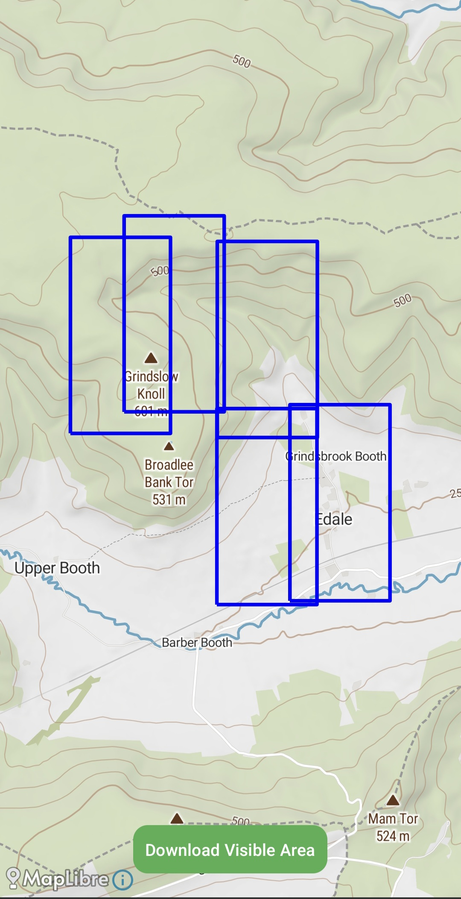
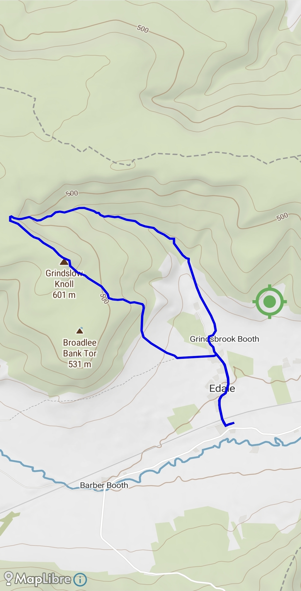
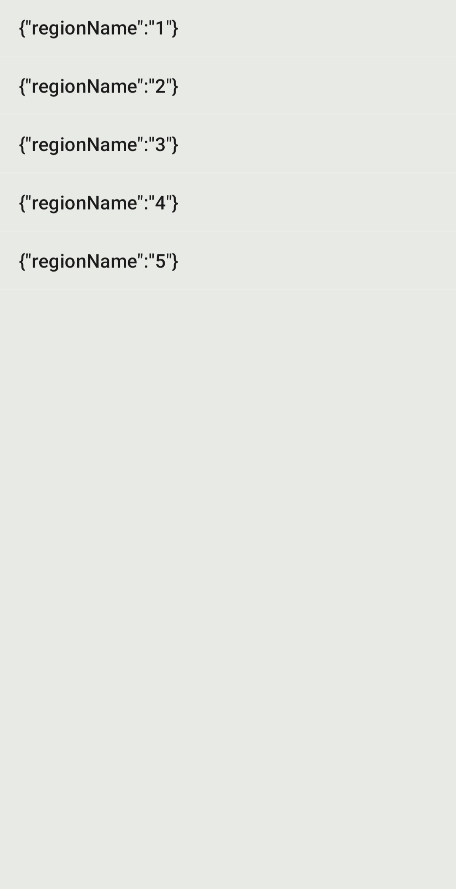

<h1>🥾 Hiking Utility App</h1>

An Android hiking companion app that provides GPS tracking, GPX route management, and offline map support — powered by <strong>MapLibre</strong> and <strong>MapTiler</strong>.

  <h2>🚀 Features</h2>
  <ul>
    <li><strong>Live GPS Tracking:</strong> Record distance, time, and pace in real-time.</li>
    <li><strong>Interactive Maps:</strong> View routes and your position with MapLibre.</li>
    <li><strong>GPX Support:</strong> Import/export GPX files for hikes or trails.</li>
    <li><strong>Offline Maps:</strong> Download and manage maps for areas without internet.</li>
    <li><strong>Simple UI:</strong> One-tap access to map, tracking, and offline tools.</li>
  </ul>

  <h2>📱 Screenshots</h2>
  

    

    

    

    

    

  

  
Replace the placeholders above with your actual app screenshots.

  <h2>⚙️ Setup & Installation</h2>
  <ol>
    <li><strong>Clone the Repository</strong>
      <pre><code>git clone https://github.com/daveeeeeehike/HikingUtility.git
cd HikingUtility</code></pre>
    </li>

    <li><strong>Open in Android Studio</strong> 
      File → Open → Select this project folder.</li>

    <li><strong>Add Your MapTiler API Key</strong>
      
Open the following files and replace the placeholder value:

      <pre><code>&lt;!-- MapActivity.java --&gt;
private static final String MAPTILER_KEY = "******";

&lt;!-- OfflineMapDownloader.java --&gt;
private static final String MAPTILER_KEY = "******";
</code></pre>
      
Replace <code>******</code> with your actual MapTiler key from <a href="https://cloud.maptiler.com/" target="_blank">https://cloud.maptiler.com/</a>.

    </li>

    <li><strong>Run the App</strong> 
      Connect your device or emulator, then click ▶️ “Run”.</li>
  </ol>

  <h2>📜 Permissions</h2>
  <ul>
    <li><code>ACCESS_FINE_LOCATION</code> — precise GPS tracking</li>
    <li><code>ACCESS_COARSE_LOCATION</code> — approximate location access</li>
  </ul>
  
Make sure to grant these permissions when prompted.

  <h2>🧭 Offline Maps</h2>
  
Use the <strong>Offline Map Downloader</strong> to download the current visible map region for offline access.  
  Manage or delete offline maps through the <strong>Offline Map Manager</strong>.

  <h2>🧰 Tech Stack</h2>
  <ul>
    <li>Java (Android)</li>
    <li>MapLibre SDK</li>
    <li>MapTiler Maps API</li>
    <li>GPX XML Parsing</li>
    <li>Android Services & Permissions</li>
  </ul>

  <h2>👤 Author</h2>
  
<strong>Dave Hike</strong> 
  Built with ❤️ for hikers, explorers, and Android developers. 
  <a href="https://maplibre.org" target="_blank">MapLibre</a> | 
  <a href="https://docs.maptiler.com" target="_blank">MapTiler Docs</a>

